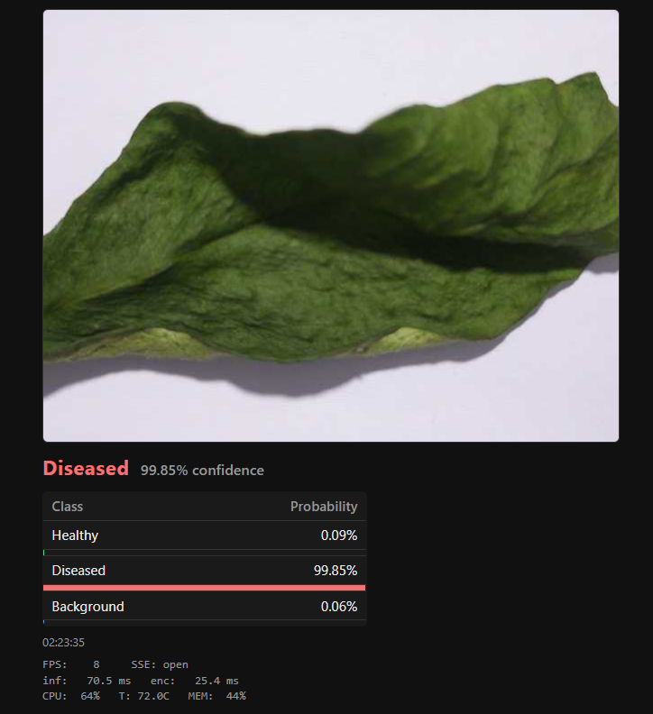
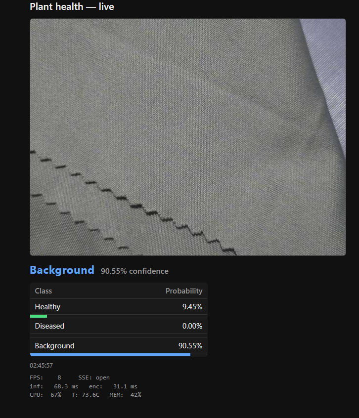
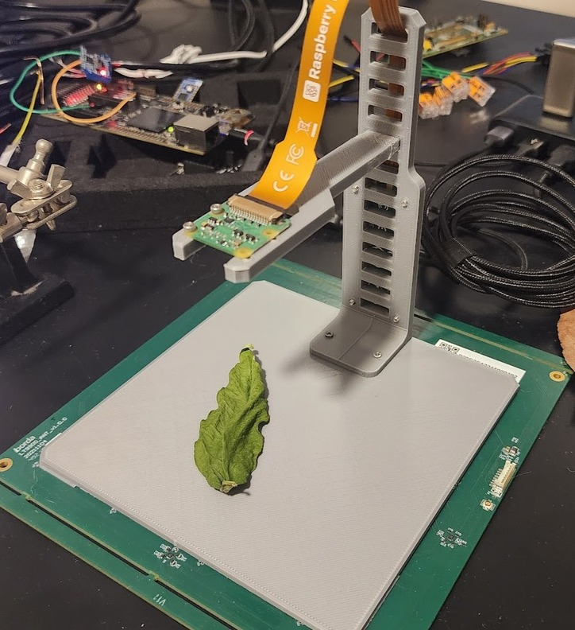
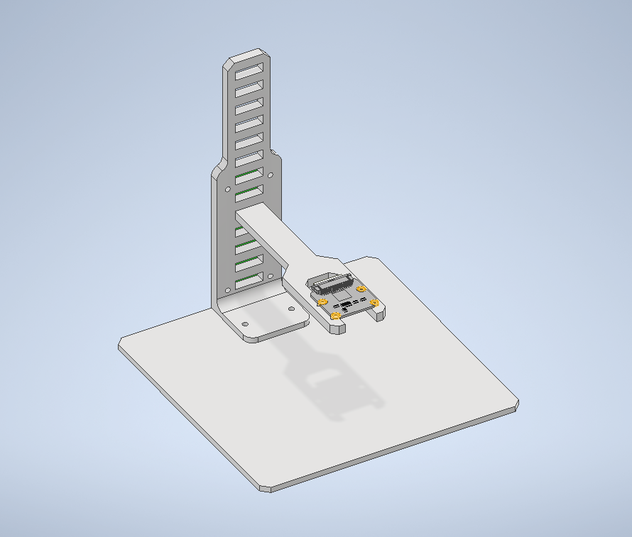
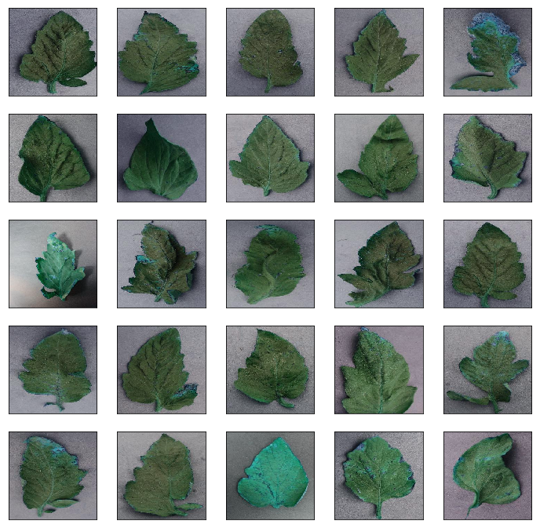
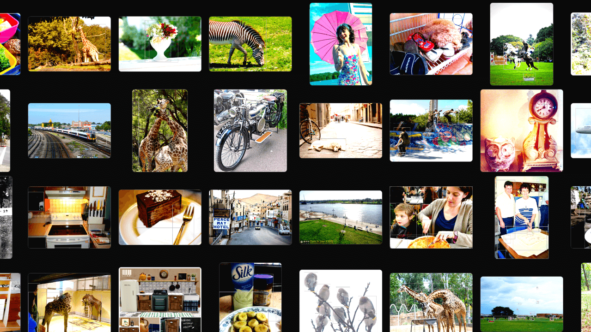

# 🌿 Plant Health Classification on a $15 Raspberry Pi

**A tiny AI that looks at a leaf through a camera and instantly says whether it's healthy, diseased, or not a leaf at all — running entirely on a Raspberry Pi Zero 2 W. No cloud. No GPU. No internet.**

Pests and diseases wipe out up to **40% of global crops** every year — roughly **$220 billion** in losses. This project puts early, on-site detection into a device that costs about the price of a lunch.

---

## 🎥 Live Demo

[](https://youtube.com/shorts/rRXCOvp1peQ)

▶️ **[Watch the demo video](https://youtube.com/shorts/rRXCOvp1peQ)** — a real leaf, a live camera, and predictions in about a tenth of a second.

---

## 📸 What It Looks Like

The device streams a live camera view to a simple web page on your phone or laptop. Point it at a leaf and it shows the prediction, the confidence for each class, and live stats like frame rate and CPU temperature.

| Diseased leaf detected | Rejecting a non-leaf scene |
|:---:|:---:|
|  |  |

It knows **three things**:

| 🟢 Healthy | 🔴 Diseased | ⚪ Background |
|:---:|:---:|:---:|
| A healthy leaf | A leaf showing disease | Anything that isn't a leaf |

That third "background" class is the trick that lets the device ignore empty scenes, hands, tables, and clutter — without needing a second AI model.

---

## 🛠️ The Test Bench

A custom 3D-printed stand holds the Pi's camera at a fixed height and lighting so results are repeatable.

| Real setup | 3D design |
|:---:|:---:|
|  |  |

---

## 📚 What It Learned From

The model was trained on **12,606 images** across the three classes:

| Real leaves (PlantVillage) | Everyday scenes (COCO) |
|:---:|:---:|
|  |  |

- **PlantVillage** leaf photos, grouped into *healthy* and *diseased*.
- **COCO** everyday photos, used as the *background* class so the model learns to say "that's not a leaf."

---

## ⚡ How Fast & Accurate Is It?

Running natively in C++ on the little Pi Zero 2 W:

| | Result |
|---|---|
| 🎯 **Accuracy** | **99.8%** on the test set |
| ⏱️ **Inference** | **~68 ms** per frame (live) |
| 🎞️ **Throughput** | **~8 images / second** |
| 💾 **Model size** | Just **1.52 million** parameters |

All of this fits comfortably inside the Pi's tiny **512 MB** of memory.

---

## 🧠 How It Works (in one breath)

```
📷 Camera  →  🖼️ Resize & normalize  →  🧠 MobileNet-V3 (ONNX)  →  🏷️ Healthy / Diseased / Background  →  🌐 Live web page
```

A **MobileNet-V3-Small** model is trained in PyTorch on a regular computer, exported to the portable **ONNX** format, then run on the Pi using a lightweight native **C++** program. The prediction is streamed to a web page over your local network.

---

## 🚀 Want the Technical Details?

This README is the friendly tour. If you want to actually build, train, and deploy it yourself, everything is documented:

- 🧪 **Training, export & full pipeline** → see the [developer guide](CLAUDE.md)
- 🔧 **C++ / Raspberry Pi build & deployment** → see [`cpp/README.md`](cpp/README.md)
- 📊 **On-device benchmarks** → [`results/rpi_zero_2w_mobilenet_onnx_cpp.md`](results/rpi_zero_2w_mobilenet_onnx_cpp.md) and [`results/edge_deployment_mobilenet_report.md`](results/edge_deployment_mobilenet_report.md)

---

## 📄 Credits

Built by **Yusuf Savaş** · Advisor: **Fikret Gürgen** · Boğaziçi University, SWE 599 Graduate Project.

Datasets: **PlantVillage** (leaf images) and **COCO 2017** (background images).
