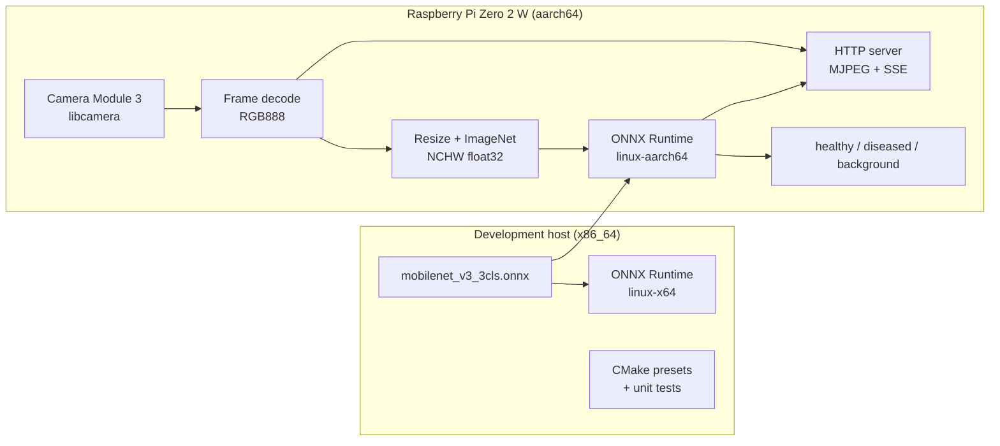

# C++ inference stack

Native **ONNX Runtime** inference for MobileNet-v3 plant health classification on **x86_64** (development) and **aarch64** (Raspberry Pi Zero 2 W). The stack covers image preprocessing, batch evaluation, optional **libcamera** capture, and an in-process HTTP server for live preview.

## Executables

| Binary | Purpose |
|--------|---------|
| `phc_infer_mobilenet` | Single image or preprocessed tensor → class label |
| `phc_evaluate_mobilenet` | Test folders (`healthy/`, `diseased/`, `background/`) → metrics + timing |
| `live_infer_web` | Live camera + inference + MJPEG/SSE web UI (requires `-DENABLE_LIBCAMERA=ON`) |

Shared libraries: **`phc_preprocess`**, **`phc_inference_ort`**, **`phc_app_runtime`**, **`phc_server_http`**, and optionally **`phc_camera_libcamera`**.

---

## Architecture



| Layer | Location | Role |
|--------|----------|------|
| Model artifact | `checkpoints/mobilenet_v3_3cls.onnx` | ONNX from Python export; class metadata in `metadata_props` |
| Preprocess | `src/preprocess/` | RGB → 224×224 bilinear, ImageNet normalize, NCHW |
| Inference | `src/inference_ort/` | ORT session, CPU, logits → argmax |
| Camera | `src/camera_libcamera/` | libcamera capture → `Frame` (RGB888) |
| Live runtime | `src/app_runtime/` | Pipeline: frame → preprocess → infer → display |
| HTTP | `src/server_http/` | Embedded HTML, MJPEG stream, SSE events, metrics |
| CLIs | `tools/`, `apps/live_infer_web/` | Batch/single inference and live web app |

---

## Tensor contract

Must match training and Python export:

| Item | Value |
|------|--------|
| Input name | `input` |
| Input shape | `[1, 3, 224, 224]` float32 NCHW |
| Output name | `logits` |
| Output shape | `[1, 3]` |
| Preprocess | Bilinear resize to 224×224, scale to `[0,1]`, ImageNet mean/std per channel |
| Classes | `0` healthy, `1` diseased, `2` background |

Class names in ONNX `metadata_props` (`class_names`, `num_classes`) are read at runtime by the ORT engine.

---

## Target hardware

- **Board:** Raspberry Pi Zero 2 W — quad-core **Cortex-A53**, **512 MB RAM**, **aarch64**.
- **OS:** 64-bit Raspberry Pi OS.
- **Camera:** Raspberry Pi Camera Module 3 via the **libcamera** stack (`live_infer_web` and `phc_camera_libcamera`).
- **Memory:** FP32 ONNX is the default; enable swap on the Pi if linking or inference is tight.

File-based inference (`phc_infer_mobilenet` with JPEG/PNG paths) uses **stb_image** and the same preprocess path as live capture.

---

## Local development (x86_64)

1. **Export ONNX** (repo root):

   ```bash
   python export_mobilenet_onnx.py
   ```

2. **ONNX Runtime:**

   ```bash
   bash scripts/download_onnxruntime.sh linux-x64
   export ONNXRUNTIME_ROOT="$(pwd)/third_party/onnxruntime/onnxruntime-linux-x64-1.24.4"
   ```

   CMake presets default to this path when `ONNXRUNTIME_ROOT` is unset.

3. **Configure, build, test:**

   ```bash
   cd cpp
   cmake --preset local-release
   cmake --build --preset local-release
   ctest --test-dir build/local-release --output-on-failure
   ```

4. **Run inference:**

   ```bash
   export LD_LIBRARY_PATH="${ONNXRUNTIME_ROOT}/lib:${LD_LIBRARY_PATH}"
   ./build/local-release/phc_infer_mobilenet ../checkpoints/mobilenet_v3_3cls.onnx /path/to/leaf.jpg
   ```

5. **Batch evaluation** (layout: `data/test/{healthy,diseased,background}/`):

   ```bash
   ./build/local-release/phc_evaluate_mobilenet ../checkpoints/mobilenet_v3_3cls.onnx ../data/test
   ```

6. **Parity vs Python** (identical float tensor, bypasses resize differences):

   ```bash
   bash scripts/validate_cpp_inference.sh /path/to/image.jpg
   ```

   Override the build directory if needed:

   ```bash
   bash scripts/validate_cpp_inference.sh --build-dir cpp/build/rpi-zero2w-release /path/to/image.jpg
   ```

`phc_infer_mobilenet` also accepts a dumped tensor:

```bash
./build/local-release/phc_infer_mobilenet model.onnx --tensor-bin preprocessed_float32_nchw.bin
```

Generate reference tensors with [`scripts/dump_ort_reference.py`](../scripts/dump_ort_reference.py).

---

## Cross-compilation (x86_64 host → Pi aarch64)

**Toolchain:** [`toolchains/rpi-aarch64/toolchain.cmake`](toolchains/rpi-aarch64/toolchain.cmake) — `aarch64-linux-gnu-gcc` / `g++`, requires **`RPI_SYSROOT`**.

**Sysroot:** sync from a Pi with [`scripts/sync_rpi_sysroot.sh`](../scripts/sync_rpi_sysroot.sh), then:

```bash
export RPI_SYSROOT="$HOME/sysroots/rpi-zero2w"
```

**ONNX Runtime:** use the **`linux-aarch64`** package from the same release as host tests:

```bash
bash scripts/download_onnxruntime.sh linux-aarch64
export ONNXRUNTIME_ROOT="$(pwd)/third_party/onnxruntime/onnxruntime-linux-aarch64-1.24.4"
```

**Build** (presets enable `ENABLE_LIBCAMERA` and `ENABLE_TESTS` for Pi):

```bash
cd cpp
cmake --preset rpi-zero2w-release
cmake --build --preset rpi-zero2w-release
ctest --test-dir build/rpi-zero2w-release --output-on-failure
```

**Deploy:** [`scripts/deploy_rpi_zero2w.sh`](../scripts/deploy_rpi_zero2w.sh) copies binaries, the ONNX model, test data, and optionally `libonnxruntime.so*` into `~/phc_deploy` on the Pi. Set `LD_LIBRARY_PATH` to the bundled `lib/` directory.

Release builds target **Cortex-A53** (`-mcpu=cortex-a53`) with LTO for static libraries.

---

## Native build on the Pi

On 64-bit Raspberry Pi OS:

```bash
bash scripts/download_onnxruntime.sh linux-aarch64
export ONNXRUNTIME_ROOT="$(pwd)/third_party/onnxruntime/onnxruntime-linux-aarch64-1.24.4"
cd cpp
cmake -B build -S . -DCMAKE_BUILD_TYPE=Release -DENABLE_LIBCAMERA=ON
cmake --build build
export LD_LIBRARY_PATH="${ONNXRUNTIME_ROOT}/lib:${LD_LIBRARY_PATH}"
./build/phc_infer_mobilenet ../checkpoints/mobilenet_v3_3cls.onnx /path/to/leaf.jpg
```

---

## Unit tests

**Catch2** (fetched by CMake) drives **`phc_tests`**, enabled by default (`ENABLE_TESTS=ON`).

Tests cover preprocessing and color normalization (`tests/test_preprocess.cpp`): RGB frame → NCHW tensor shape, rejection of non-RGB formats, and BGR/RGB packed pixel handling.

```bash
cmake --preset local-release
cmake --build --preset local-release
ctest --test-dir build/local-release --output-on-failure
# or:
./build/local-release/phc_tests
```

---

## ONNX Runtime ABI

Link and run with the **same ONNX Runtime major version**. Ship `libonnxruntime.so*` next to binaries or set `LD_LIBRARY_PATH`. CMake sets `BUILD_RPATH` / `INSTALL_RPATH` for development and deploy layouts.

---

## Live web preview (`live_infer_web`)

Runs the camera pipeline and serves a self-contained UI from the binary. [`web/live/index.html`](../web/live/index.html) is embedded at build time via [`cmake/embed_html.cmake`](cmake/embed_html.cmake).

**Build:**

```bash
cmake --preset rpi-zero2w-release   # libcamera ON by default for Pi preset
# or locally, if libcamera dev packages are installed:
cmake -B build -S . -DENABLE_LIBCAMERA=ON
cmake --build build
```

**Run on the Pi:**

```bash
export LD_LIBRARY_PATH="${ONNXRUNTIME_ROOT}/lib:${LD_LIBRARY_PATH}"
./build/rpi-zero2w-release/live_infer_web /path/to/mobilenet_v3_3cls.onnx --port 8080
```

Open `http://<pi-ip>:8080/` in a browser.

### HTTP endpoints

| Endpoint | Content type | Purpose |
|----------|--------------|---------|
| `GET /` | `text/html` | Embedded live UI |
| `GET /stream.mjpg` | `multipart/x-mixed-replace; boundary=phcframe` | MJPEG preview |
| `GET /events` | `text/event-stream` | SSE inference JSON (`timestamp_ns`, `label`, `label_name`, `confidence`, `logits`, `probabilities`, `inference_ms`, `encode_ms`) |
| `GET /metrics` | `application/json` | System metrics (~1 Hz): load, memory, CPU temperature, CPU percent |
| `GET /healthz` | `text/plain` | Liveness probe |

**CLI:** `--port N` (default `8080`), `--bind HOST` (default `0.0.0.0`). JPEG quality is set in `HttpStreamDisplayConfig` (default `50`).

The server is HTTP only. Use firewall rules or bind to `127.0.0.1` with SSH port forwarding on untrusted networks.

---

## CMake options and presets

| Option | Default | Effect |
|--------|---------|--------|
| `ENABLE_LIBCAMERA` | OFF (ON in `rpi-zero2w-*` presets) | Build `phc_camera_libcamera` and `live_infer_web` |
| `ENABLE_TESTS` | ON | Build `phc_tests` and register CTest |

Presets in [`CMakePresets.json`](CMakePresets.json):

| Preset | Platform | Binary dir |
|--------|----------|------------|
| `local-release` / `local-debug` | Native x86_64 | `build/local-release`, `build/local-debug` |
| `rpi-zero2w-release` / `rpi-zero2w-debug` | Cross aarch64 | `build/rpi-zero2w-release`, `build/rpi-zero2w-debug` |

Requires **`ONNXRUNTIME_ROOT`** (set in preset `environment` or exported). Cross presets require **`RPI_SYSROOT`**.

---

## Source layout

| Path | Purpose |
|------|---------|
| `src/preprocess/mobilenet_preprocess.*` | Image/file → NCHW tensor |
| `src/inference_ort/ort_engine.*` | ORT session, metadata, forward pass |
| `src/core/` | `Frame`, `TensorF32`, RGB normalize, logging |
| `src/mobilenet/mobilenet_common.*` | Shared label/metrics helpers for CLIs |
| `src/camera_libcamera/` | libcamera → `Frame` |
| `src/app_runtime/live_pipeline.*` | Live capture → infer → display callback |
| `src/server_http/` | HTTP server, MJPEG encoder, embedded HTML |
| `tools/infer_mobilenet.cpp` | `phc_infer_mobilenet` |
| `tools/evaluate_mobilenet.cpp` | `phc_evaluate_mobilenet` |
| `apps/live_infer_web/main.cpp` | `live_infer_web` |
| `tests/test_preprocess.cpp` | Catch2 unit tests |
| `toolchains/rpi-aarch64/toolchain.cmake` | Pi cross-compile toolchain |
| `toolchains/gcc/toolchain.cmake` | Native GCC warnings/flags |
| `cmake/embed_html.cmake` | HTML → C++ embedding |
| `third_party/stb/` | `stb_image`, `stb_image_write` |
| `third_party/cpp-httplib/` | `httplib.h` (v0.46.0) |
| `CMakeLists.txt` | Targets, ORT discovery, FetchContent Catch2 |
