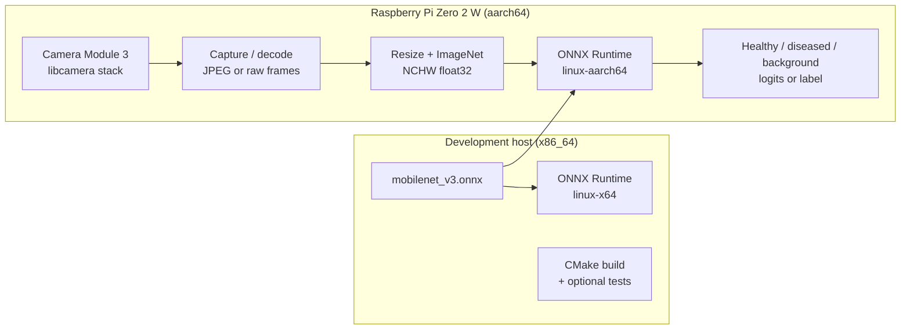

# C++ side — architecture & operations

This document describes how the C++ inference stack is structured, how it maps to **Raspberry Pi Zero 2 W** + **Camera Module 3**, how to **develop and test on a PC**, how **unit tests** fit in, and how **cross-compilation** is intended to work.

Executable tools today:

- **`phc_infer_mobilenet`** — single-image inference (ORT forward pass).
- **`phc_evaluate_mobilenet`** — batch evaluation on `healthy/` / `diseased/` / `background/` folders (metrics + timing).
- **`live_infer_web`** (optional, `-DENABLE_LIBCAMERA=ON`) — live camera + inference + in-process HTTP server streaming the preview as MJPEG and inference results over Server-Sent Events.

Shared preprocessing and ONNX Runtime wiring live under **`src/preprocess`**, **`src/inference_ort`**, and related modules.

---

## 1. Architecture overview



**Layers (conceptual):**

| Layer | Role | Status in repo |
|--------|------|----------------|
| **Model artifact** | `checkpoints/mobilenet_v3.onnx` (from Python export) | Yes |
| **Preprocess** | RGB → 224×224 bilinear, ImageNet normalize, NCHW | `src/preprocess/mobilenet_preprocess.*` |
| **Inference** | ORT session, CPU, logits → argmax / metrics | `phc_infer_mobilenet`, `phc_evaluate_mobilenet` |
| **Camera / ISP** | Acquire frames from Camera Module 3 | **Not in tree yet** — integrate via libcamera or capture-to-file then reuse `ImageToNchw` |
| **Tests** | Unit tests for math helpers; optional integration tests with ORT | **To add** (see §5) |

---

## 2. Target deployment: Pi Zero 2 W + Camera Module 3

- **Board:** Raspberry Pi Zero 2 W (quad-core **Cortex-A53**, **aarch64**; 512 MB RAM — prefer **quantized** ONNX if inference is tight).
- **Camera:** Raspberry Pi Camera Module 3 uses the **libcamera** stack on modern Raspberry Pi OS (not the legacy `raspistill` pipeline).

**Recommended integration patterns (choose one later):**

1. **File-based (simplest):** A small capture utility or `rpicam-still` writes a JPEG; your existing path loads it with **stb_image** + `ImageToNchw`. Good for bring-up and parity with desktop tests.
2. **In-process:** Link **libcamera** (or a thin wrapper) and feed decoded RGB buffers into the same preprocessing function used for files — same tensor contract, lower latency, more code.

**Contract (must match training — unchanged):**

- Input tensor: name `input`, shape `[1, 3, 224, 224]`, float32, **NCHW**.
- Output: name `logits`, shape `[1, 3]`.
- RGB: resize **224×224** (bilinear), scale to `[0,1]`, ImageNet mean/std per channel.
- Classes (must match `utils.data_loader.DEFAULT_CLASSES`): `0` = healthy, `1` = diseased, `2` = background.

---

## 3. Local development (test on your PC)

Use this to iterate **without** the Pi: same ONNX file, same preprocessing contract, faster edit/build cycles.

1. **Export ONNX** (repo root): `python export_mobilenet_onnx.py` → `checkpoints/mobilenet_v3.onnx`.
2. **ONNX Runtime (x86_64):**

   ```bash
   bash scripts/download_onnxruntime.sh linux-x64
   export ONNXRUNTIME_ROOT="$(pwd)/third_party/onnxruntime/onnxruntime-linux-x64-1.24.4"
   ```

   Adjust the path if your version differs.

3. **Configure & build:**

   ```bash
   cd cpp
   cmake --preset local-release
   cmake --build --preset local-release
   ```

4. **Run inference:**

   ```bash
   export LD_LIBRARY_PATH="${ONNXRUNTIME_ROOT}/lib:${LD_LIBRARY_PATH}"
   ./build/local-release/phc_infer_mobilenet ../checkpoints/mobilenet_v3.onnx /path/to/leaf.jpg
   ```

5. **Batch evaluation** (same layout as Python `data/test/healthy`, `data/test/diseased`, and `data/test/background`):

   ```bash
   ./build/local-release/phc_evaluate_mobilenet ../checkpoints/mobilenet_v3.onnx ../data/test
   ```

6. **Strict parity vs Python** (same float tensor, bypasses resize differences between stacks):

   ```bash
   bash scripts/validate_cpp_inference.sh /path/to/image.jpg
   ```

   `validate_cpp_inference.sh` resolves `phc_infer_mobilenet` from `cpp/build/local-release` by default.
   If your binary is elsewhere, pass an override:

   ```bash
   bash scripts/validate_cpp_inference.sh --build-dir cpp/build/rpi-zero2w-release /path/to/image.jpg
   ```

This gives you **local functional tests** of the model + C++ stack before any cross-build.

---

## 4. Cross-compilation (host x86_64 → Pi aarch64)

**Idea:** Build on a fast machine with a **GCC/Clang aarch64-linux-gnu toolchain** and a **sysroot** (or staged rootfs) that holds Pi-compatible headers/libs for anything beyond ONNX Runtime’s bundled dependency (e.g. if you later add libcamera).

**ONNX Runtime:** Use the official **`linux-aarch64`** CPU package from the same release line as your host tests, and point **`ONNXRUNTIME_ROOT`** at that tree during the cross build (headers + `libonnxruntime.so` for **aarch64**).

**Typical CMake pattern:**

- Toolchain file sets `CMAKE_C_COMPILER`, `CMAKE_CXX_COMPILER` to `aarch64-linux-gnu-gcc` / `g++`, and optionally `CMAKE_SYSROOT` / `CMAKE_FIND_ROOT_PATH` for the Pi sysroot.
- Invoke CMake with `-DCMAKE_TOOLCHAIN_FILE=...` and still pass `-DONNXRUNTIME_ROOT=...` (or env) to the **aarch64** ORT unpack path.

**Deploy:** Copy the binary, `mobilenet_v3.onnx`, and the matching **`libonnxruntime.so.*`** (or set `LD_LIBRARY_PATH` / `rpath` as today). Verify with `readelf -d` / `ldd` on the Pi.

**Memory:** Pi Zero 2 W has **512 MB RAM** — enable swap if linking OOMs; consider **INT8** ONNX (`quantize_mobilenet_onnx.py`) for headroom.

---

## 5. Unit tests (libraries & pure code)

**Goal:** Test **deterministic** pieces without requiring a camera or flaky I/O.

**Good candidates:**

- **Bilinear resize** (fixed small `src` / `dst`, golden output bytes).
- **ImageNet NCHW layout** (known RGB patch → expected float at a few indices).
- **Argmax / softmax helpers** if extracted from printing code.
- **Stub ORT session** (optional): heavier; often reserved for **integration** tests on CI with ORT loaded.

**Suggested stack (not wired in yet):**

- **GoogleTest** or **Catch2** + **CTest** (`enable_testing()`, `add_test()`).
- Split pure functions into **small translation units** under something like `cpp/src/` / `cpp/test/` so tests link only what they need.

Run tests on **x86_64** first; add **aarch64** test runs on real Pi or QEMU if you need full confidence on device.

---

## 6. Reference: Pi native build (no cross compiler)

On **64-bit** Raspberry Pi OS (aarch64):

```bash
bash scripts/download_onnxruntime.sh linux-aarch64
export ONNXRUNTIME_ROOT="$(pwd)/third_party/onnxruntime/onnxruntime-linux-aarch64-1.24.4"
cd cpp && cmake -B build -S . && cmake --build build
export LD_LIBRARY_PATH="${ONNXRUNTIME_ROOT}/lib:${LD_LIBRARY_PATH}"
./build/phc_infer_mobilenet ../checkpoints/mobilenet_v3.onnx /path/to/leaf.jpg
```

---

## 7. ABI note

Build and run with the **same ONNX Runtime major version** at link time and runtime; ship `libonnxruntime.so*` next to the binary or set `LD_LIBRARY_PATH`.

---

## 8. Web live preview (headless Pi, file artifacts)

**`live_infer_web`** runs the live camera pipeline and serves a self-contained web UI directly from the binary. [`web/live/index.html`](../web/live/index.html) is embedded at build time (see [`cmake/embed_html.cmake`](cmake/embed_html.cmake)).

**Build** (needs libcamera):

```bash
cmake -B build -S . -DENABLE_LIBCAMERA=ON
cmake --build build
```

**Run** on the Pi:

```bash
export LD_LIBRARY_PATH="${ONNXRUNTIME_ROOT}/lib:${LD_LIBRARY_PATH}"
./build/live_infer_web /path/to/mobilenet_v3.onnx --port 8080
```

Then open `http://<pi>:8080/` in a browser.

**HTTP surface**:

| Endpoint | Content type | Purpose |
|----------|--------------|---------|
| `GET /` | `text/html` | Embedded live UI page |
| `GET /stream.mjpg` | `multipart/x-mixed-replace; boundary=phcframe` | Live MJPEG preview, one part per frame |
| `GET /events` | `text/event-stream` | SSE stream of inference result JSON (`timestamp_ns`, `label`, `label_name`, `confidence`, `logits`, `probabilities`, `inference_ms`, `encode_ms`) |
| `GET /metrics` | `application/json` | Pi system metrics for the live page (load average, memory, CPU temperature, CPU percent). Intended for ~1 Hz polling. Missing `/proc` or `/sys` fields are omitted, not faked |
| `GET /healthz` | `text/plain` | Liveness probe |

**CLI flags**: `--port N` (default `8080`), `--bind HOST` (default `0.0.0.0`), `--jpeg-quality Q` (default `70`). The second positional argument is still accepted as a port for backward compatibility, but the old artifact-directory positional argument is gone.

The server is HTTP only; prefer firewall rules or binding to `127.0.0.1` plus SSH port-forwarding if the network is not trusted.

---

## 9. File map (current)

| File | Purpose |
|------|---------|
| `src/mobilenet/` … | Preprocess, ORT run, console output helpers |
| `tools/infer_mobilenet.cpp` | CLI: model + image or `--tensor-bin` (builds `phc_infer_mobilenet`) |
| `tools/evaluate_mobilenet.cpp` | CLI: model + test folder, metrics (builds `phc_evaluate_mobilenet`) |
| `src/server_http/http_stream_server.*` | In-process HTTP server: MJPEG (`/stream.mjpg`) + SSE (`/events`) + embedded HTML (`/`) |
| `src/server_http/http_stream_display.*` | `IDisplay` that JPEG-encodes each frame and pushes it to `HttpStreamServer` |
| `apps/live_infer_web/main.cpp` | Live pipeline + in-process HTTP server (requires libcamera). Run with `--port N` |
| `cmake/embed_html.cmake` | Generates `embedded_index_html.cpp` from `web/live/index.html` at build time |
| `CMakeLists.txt` | ORT discovery, vendored stb + cpp-httplib includes, binaries |
| `third_party/stb/` | Vendored `stb_image.h` and `stb_image_write.h` headers |
| `third_party/cpp-httplib/` | Vendored `httplib.h` (MIT, pinned to v0.46.0) |

Future work for your roadmap: **toolchain file** for cross-builds, expanded **test/** tree.
