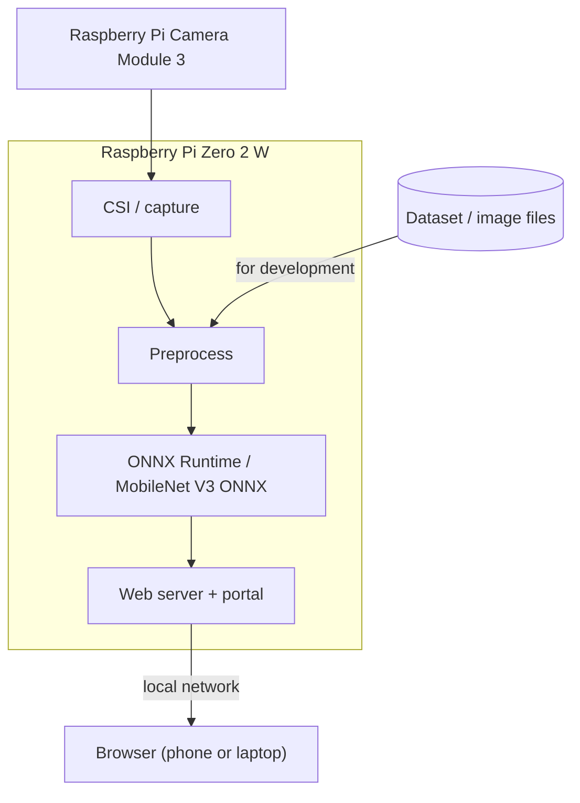

# Edge deployment: Plant health classification (MobileNet V3) on Raspberry Pi Zero 2 W

## 1. Introduction

Running machine learning on the edge means running models on small devices near where data is collected or where people use them, not only in big cloud servers. That helps when you care about fast responses, keeping data local, unreliable internet, or saving battery and power. A typical approach is to save a trained model in a portable format and run it with a small runtime on a compact computer or even a tiny microcontroller.

This work focuses on **edge deployment of a plant health classifier**: given a leaf image, the system predicts whether the plant appears **healthy** or **diseased**. The **motivation** includes:

- **Engineering**: validate that a compact CNN (**MobileNet V3**) can run end-to-end on constrained hardware (**Raspberry Pi Zero 2 W**) with acceptable accuracy and measurable throughput.
- **Learning**: understand the **role of quantization and INT8-oriented optimization** in that setting. Quantization reduces numeric precision (often from FP32 to INT8) to shrink model size and speed up CPU inference; the trade-off is potential accuracy loss. Documented results establish an **FP32 ONNX baseline** on the Pi so a later **INT8** deployment can be compared on accuracy, latency, and throughput.
- **Native code vs. Python on the edge**: **C++** skips the Python interpreter and **GIL**, so it can run faster on a small CPU and use **512 MB RAM** more predictably. **ONNX Runtime** is often called from **native** code in production. **Python** is still a good fit for training and quick tests; **C++** is a common choice for **always-on** or **camera-stream** inference on tight hardware.
- **Real-world validation**: Even if a model does well on well-chosen leaf photos, we need to see how it works “in real life” with real leaves, real lighting, and photos taken with an actual camera. This testing checks if the model handles blur, bad lighting, background mess, and camera noise. It helps find problems before the system is used for real.

---

## 2. Overview

### 2.1 Hardware

**Raspberry Pi Zero 2 W** was chosen as a **low-cost, resource-constrained** edge node:

| Item | Detail |
| --- | --- |
| CPU | Quad-core ARM Cortex-A53 (~1 GHz class) |
| RAM | 512 MB |
| Acceleration | inference is **CPU-bound** |
| Role | Baseline for always-on or field-style deployments|

### 2.2 Software

- **Model**: **MobileNet V3** exported to **ONNX** for deployment.
- **Runtime**: **ONNX Runtime** used from **C++**, not Python, so latency and FPS reflect the actual on-device stack instead of extra interpreter overhead.
- **Pipeline**: **Image in → MobileNet-style preprocessing → ONNX Runtime inference → class scores / label**.
- **Web UI**: a **web portal** on the device (or on the LAN) shows **camera view**, **live predictions**, **summary metrics**, and **throughput (e.g. FPS or images per second)**.

### 2.3 Use

In practice the app does one thing: from a picture of a leaf it guesses whether the plant looks **healthy** or **unhealthy**.

For a **demo**, you open the **web page** on your phone or laptop (on the same Wi‑Fi as the device). You show **healthy** and **unhealthy** plants to the camera, or step through example images, and everyone can see the **label** the model picked and **how many frames per second** it is running.

### 2.4 Diagram

---

## 3. Requirements

### 3.1 Features

- Open a **web portal** and see **inference results** (predicted class and, where applicable, confidence).
- See **performance at a glance**: **FPS** (or equivalent throughput) and, if useful, **per-frame or rolling latency**, updated as the system runs.
- Run **single-image** or **stream/batch** inference through the same stack so lab tests and field-style runs share one pipeline.

**Layers**

| Layer | Role |
| --- | --- |
| **Presentation** | Web UI (portal) for status, predictions, FPS, and optional history or session summary. |
| **Application / API** | Serves the UI and exposes inference status and metrics to it (e.g. HTTP or WebSocket). |
| **Inference** | Loads the **MobileNet V3 ONNX** graph, applies consistent preprocessing, runs **ONNX Runtime** on the device CPU. |
| **Acquisition (optional path)** | Feeds frames from storage or from a **camera** into the preprocessor; same graph for file replay and live capture when implemented. |
| **Quantization track** | Same topology with **INT8** weights for comparison against the **FP32** baseline, with accuracy and speed measured under identical UI and metrics. |

**Offline tests**

- Ability to score a **fixed labeled test split** and report **classification metrics** (accuracy, balanced accuracy, precision/recall/F1 for the diseased class, specificity) and a **confusion matrix**, independent of the portal, for rigorous comparison between FP32 and INT8 builds.

### 3.2 Quality

- **Deployability**: run on **512 MB RAM** and a **quad-core A53** CPU without a GPU on the edge device.
- **Reproducibility**: evaluation procedures and hardware context are recorded so accuracy and throughput numbers remain comparable across model variants.
- **Observability**: **accuracy** (from labeled runs) is separable from **latency / throughput** (portal and benchmarks); end-to-end timing includes load, preprocess, and runtime where applicable.

---

## 4. Design

### 4.1 Choices

- **MobileNet V3** balances accuracy and a small parameter count (on the order of **1.5M** parameters) for edge use.
- **ONNX + ONNX Runtime** provides a **deployment-oriented** graph and a runtime tuned for multiple backends; a **native** caller keeps measurements close to how the stack would ship in production.
- **FP32 baseline first**, then **INT8** (or similar) as a controlled experiment: smaller artifacts and faster integer math on CPU, with accuracy tracked against the same test protocol.
- **Web portal** as the default way to **see results and FPS** aligns the system with operator expectations and simplifies demos and field checks.

### 4.2 Pipeline

1. **Input**: image from file, batch folder, or (when available) camera frame.
2. **Preprocess**: resize and normalize to match training/export conventions.
3. **Inference**: ONNX Runtime executes the graph on the CPU.
4. **Output**: class prediction (and optional scores); metrics feed the **portal** and any batch evaluator.
5. **Presentation**: portal displays **prediction**, **FPS / throughput**, and optional aggregates.

### 4.3 Quantization

A reduced-precision build (e.g. **INT8** weight quantization) targets **smaller footprint and faster inference** on the same CPU, with **accuracy and FPS** compared to the **FP32** baseline under the same preprocessing and portal-facing metrics.

---

## 5. Results

The tables below summarize **benchmark-style** runs: **edge** (Raspberry Pi Zero 2 W, ONNX Runtime via native code on **FP32** ONNX) and **development workstation** (PyTorch on **CUDA**). Sample counts refer to test split of **8106** images.

### 5.1 Pi Zero 2 W (FP32 ONNX)

These numbers use **FP32** ONNX only (**INT8** not used here).

**Metrics (8106 test images)**

| Metric | Value |
| --- | --- |
| Accuracy | 0.9983 (99.83%) |
| Balanced accuracy | 0.9978 (99.78%) |
| Precision (diseased) | 0.9988 (99.88%) |
| Recall (diseased) | 0.9988 (99.88%) |
| F1 (diseased) | 0.9988 (99.88%) |
| Specificity (healthy) | 0.9968 (99.69%) |

**Confusion matrix**

|  | Pred: healthy | Pred: diseased |
| --- | ---:| ---:|
| **Actual: healthy** | 2215 | 7 |
| **Actual: diseased** | 7 | 5877 |

TN: 2215, FP: 7, FN: 7, TP: 5877

**Speed** (load, preprocess, infer; 8106 images)

| Measure | Value |
| --- | --- |
| Total time | 1009.689 s |
| Avg / image | 124.561 ms |
| Throughput | 8.028 img/s |

### 5.2 Dev PC (GPU, reference)

**Setup** (example): Ubuntu 24.04 LTS on **WSL2**; **CPU**: AMD Ryzen 7 5800H; **GPU**: NVIDIA GeForce RTX 3050 Laptop (4 GB VRAM).

**Test metrics**

| Metric | Value |
| --- | --- |
| Accuracy | 0.9980 (99.80%) |
| Balanced accuracy | 0.9972 (99.72%) |
| Precision (diseased) | 0.9983 (99.83%) |
| Recall (diseased) | 0.9990 (99.90%) |
| F1 (diseased) | 0.9986 (99.86%) |
| Specificity (healthy) | 0.9955 (99.55%) |
| MCC | 0.9950 |
| ROC-AUC | 1.0000 |
| Parameters | 1,519,906 |

**Confusion matrix**

|  | Pred: healthy | Pred: diseased |
| --- | ---:| ---:|
| **Actual: healthy** | 2212 | 10 |
| **Actual: diseased** | 6 | 5878 |

TN: 2212, FP: 10, FN: 6, TP: 5878

**Speed** (full eval loop)

| Measure | Value |
| --- | --- |
| Total | 10.7903 s |
| Avg / image | 1.331 ms |
| Throughput | 751.23 img/s |

---

## 6. Conclusion

On the **Pi Zero 2 W**, **FP32 ONNX** with **ONNX Runtime** stays accurate on the held-out test set and runs at about **8 images/s** end-to-end on the CPU alone. That gives a solid starting point before trying **INT8** or other speedups. **Testing with a real camera in real conditions** still matters, because lab-style test images do not cover everything you see in the field.

---

## 7. Future work

- [ ] **Camera**: add a **live camera** path that uses the same preprocess → ONNX Runtime stack as file-based evaluation.
- [ ] **Field tests**: systematic runs **outdoors / in greenhouses** with **natural lighting** and varied distances, not only dataset-style images.
- [ ] **Speedups**: **INT8** (or similar) quantization, runtime flags, and threading tuned for Cortex-A53; re-measure **accuracy vs FPS** on device; raise images per second.
- [ ] **UI**: make **FPS**, latency, and errors easy to see when inference or the camera degrades.
- [ ] **Calibration**: optional score calibration or thresholds for diseased vs healthy when moving from lab to field.
